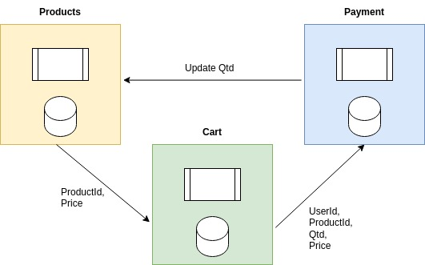

# Store 

- Project used to study about microservices.

<!--  -->

#### RabbitMQ

- https://www.rabbitmq.com/download.html
- docker run -it --rm --name rabbitmq -p 5672:5672 -p 15672:15672 rabbitmq:3.12-management

- http://localhost:15672/
- user: guest
- password: guest