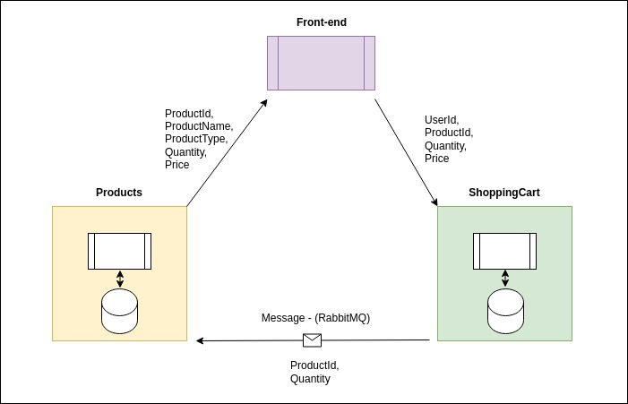
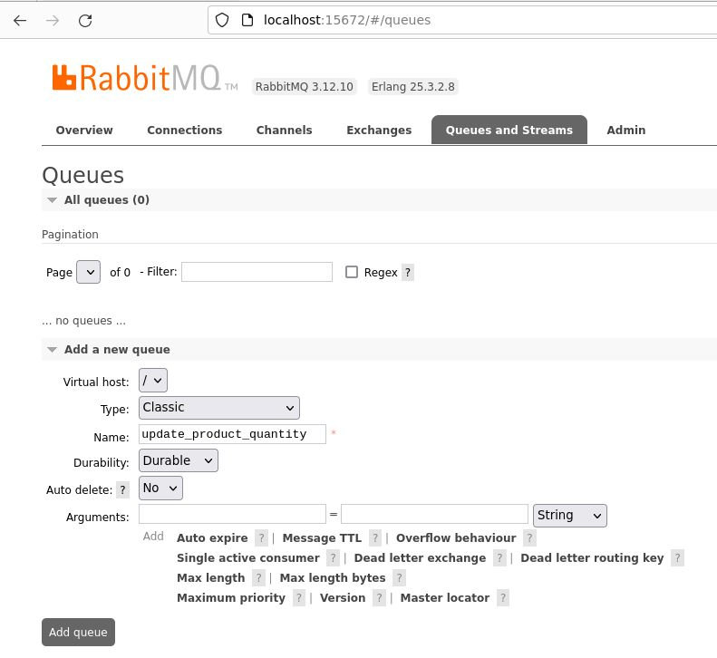
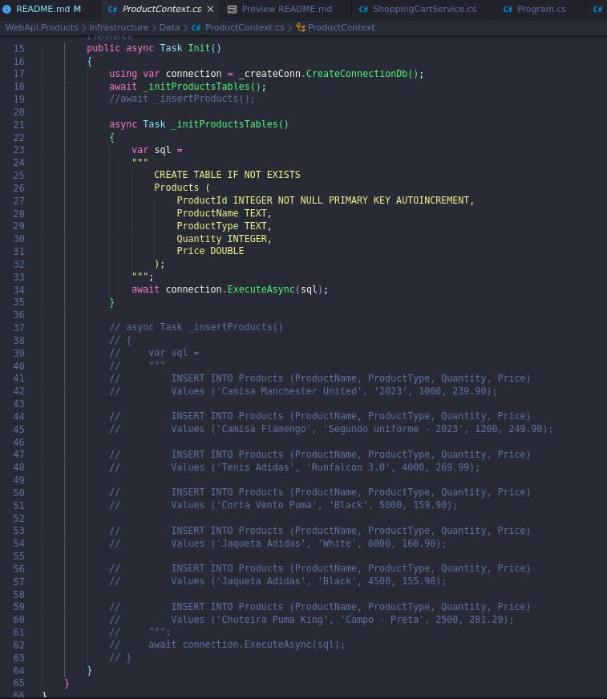

# Store (Shopping cart services)
- (I've been updating this project constantly).
- Simple project used to study about microservices and apply some technologies and knowledges.
- Basically there are 2 WebApis: Product and Shopping Cart.
- The Product Api sends a products list or unique product (get by id) to Front-end app, using HTTP requests.
- The front-end app sends to ShoppingCart Api by HTTP request: [UserId, ProductId, Quantity, Price].
- The ShoppingCart Api sends by messaging (RabbitMQ) to Products Api: [ProductId and Quantity].
- Product Api consumes the queue and update the quantity by ProductId.



### Technologies applied:

- [x] - .Net 7 (C#)
    - Product WebApi:
        - [x] - Clean Architecture
        - [x] - Dapper
        - [x] - Mapper
        - [x] - SQLite Database
        - [x] - RabbitMQ (Consumer)
        - [ ] - Logger
        - [ ] - Unit Tests
    - ShoppingCart WebApi:
        - [x] - Clean Architecture
        - [x] - Dapper
        - [x] - Mapper
        - [x] - SQLite Database
        - [x] - RabbitMQ (Producer)
        - [x] - Logger 
        - [ ] - Unit Tests
- [ ] - K6 Load Test
- [ ] - Docker
- [?] - Front End (I don't know if I will do it).

### To run RabbitMQ:

- I preferred not to install RabbitMQ because I don't have free space in my Virtual Machine, I've been using a Docker container to use RabbitMQ.

- You can execute to create a container:
 ```
 docker run -it --rm --name rabbitmq -p 5672:5672 -p 15672:15672 rabbitmq:3.12-management
 ```

- http://localhost:15672/
- user: guest
- password: guest

- You need to creat the queue called: 
```update_product_quantity```



- (You will need to create the queue everytime that you want use the system).

- You can see more here: https://www.rabbitmq.com/download.html

- In the WebApis (Product and ShoppingCart), It will be necessary install the RabbitMQ client.
 - To install the client, execute it:
```
 dotnet add package RabbitMQ.Client
 ```

 ### Running Product WebApi:
- The first time that you run the WebApi, It will be created a Database.
- Before to use the WebApi, you need populate the table (Products).
- There is a script called ```Insert_product.sql``` in ```Util/Scripts```.
- ...Or you can uncomment the lines commented in ```Infrastructure/Data/ProductContext.cs``` (line 19 and lines between 37 and 63).



- To run webapi, execute it:
```
dotnet run
```
- It will run on:
- http://localhost:5013/swagger/index.html

- (OBS): after the first time that you runned the WebApi, comment the lines (line 19 and lines between 37 and 63) again.


### Running ShoppingCart WebApi:
- The first time that you run the WebApi, It will be created a Database.
- To run webapi, execute it:
```
dotnet run
```

- It will run on:
 - http://localhost:5227/swagger/index.html