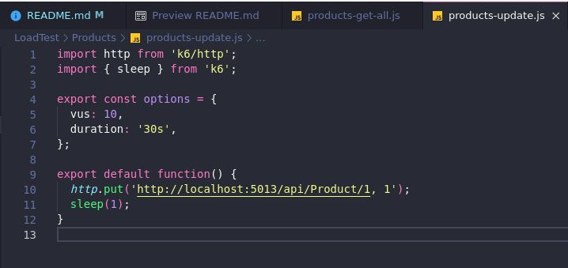

# Store (Shopping cart services)
- (I've been updating this project constantly).
- Simple project used to study about microservices and apply some technologies and knowledges.
- Basically there are 2 WebApis: Product and Shopping Cart.
- The Product Api sends a products list or unique product (get by id) to Front-end app, using HTTP requests.
- The front-end app sends to ShoppingCart Api by HTTP request: [UserId, ProductId, Quantity, Price].
- The ShoppingCart Api sends by messaging (RabbitMQ) to Products Api: [ProductId and Quantity].
- Product Api consumes the queue and update the quantity by ProductId.


### Technologies applied:

- [x] - .Net 7 (C#)
    - Product WebApi:
        - [x] - Clean Architecture
        - [x] - Dapper
        - [x] - Mapper
        - [x] - SQLite Database
        - [x] - RabbitMQ (Consumer)
        - [x] - Logger
        - [x] - Load Tests - K6
        - [x] - Unit Tests
    - ShoppingCart WebApi:
        - [x] - Clean Architecture
        - [x] - Dapper
        - [x] - Mapper
        - [x] - SQLite Database
        - [x] - RabbitMQ (Producer)
        - [x] - Logger 
        - [x] - Load Tests - K6
        - [ ] - Unit Tests
- [x] - Git Submodules
- [x] - Azure Pipelines (Multi-Stage)
- [ ] - Docker
- [?] - Front End (I don't know if I will do it).

### Git submodules:
- I moved the projects to their respective repositories.
- Project WebApi.Products: 
https://github.com/rslewenstein/WebApi.Products

- Project WebApi.ShoppingCart:
https://github.com/rslewenstein/WebApi.ShoppingCart

#### - To clone a project using submodules:
```
git clone <URL_MAIN_PROJECT>
```
```
git submodule update --init --recursive
```

#### - To update a project submodule in the main project:
- just enter the project and execute:
```
git pull
```

- You can see more about Git Submodules here:
https://git-scm.com/book/en/v2/Git-Tools-Submodules

### To run RabbitMQ:

- I preferred not to install RabbitMQ because I don't have free space in my Virtual Machine, I've been using a Docker container to use RabbitMQ.

- You can execute to create a container:
 ```
 docker run -it --rm --name rabbitmq -p 5672:5672 -p 15672:15672 rabbitmq:3.12-management
 ```

- http://localhost:15672/
- user: guest
- password: guest

- You need to creat the queue called: 
```update_product_quantity```


- (You will need to create the queue everytime that you want use the system).

- You can see more here: https://www.rabbitmq.com/download.html

- In the WebApis (Product and ShoppingCart), It will be necessary install the RabbitMQ client.
 - To install the client, execute it:
```
 dotnet add package RabbitMQ.Client
 ```

 ### Running Product WebApi:
- The first time that you run the WebApi, It will be created a Database.
- Before to use the WebApi, you need populate the table (Products).
- There is a script called ```Insert_product.sql``` in ```Util/Scripts```.
- ...Or you can uncomment the lines commented in ```Infrastructure/Data/ProductContext.cs``` (line 19 and lines between 37 and 63).


- To run webapi, execute it:
```
dotnet run
```
- It will run on:
- http://localhost:5013/swagger/index.html

- (OBS): after the first time that you runned the WebApi, comment the lines (line 19 and lines between 37 and 63) again.


### Running ShoppingCart WebApi:
- The first time that you run the WebApi, It will be created a Database.
- To run webapi, execute it:
```
dotnet run
```

- It will run on:
 - http://localhost:5227/swagger/index.html

 ### Installing k6 Load Test:
 - k6 is a tool by Grafana.
 - It's used to do load tests.
 - To install, you can see more here: https://grafana.com/docs/k6/latest/get-started/installation/
 - I tried use Docker container, but it didn't work for me.
 - I use Linux and I installed in Linux.
 
 #### Running k6 (https://grafana.com/docs/k6/latest/get-started/running-k6/):
 - create a js file:
 ```
 k6 new 
 or 
 k6 new SCRIPT_NAME.js
 ```

 - You need configure the endpoint, like this:

 

 - running your script:
 ```
 $ k6 run script.js
 ```
or  to define VUs = 10 and duration = 30s.
 ```
$ k6 run --vus 10 --duration 30s script.js
 ```

### About Azure Pipelines:
- You can see more about pipelines here:
https://learn.microsoft.com/pt-br/azure/devops/pipelines/create-first-pipeline?view=azure-devops&tabs=net%2Ctfs-2018-2%2Cbrowser